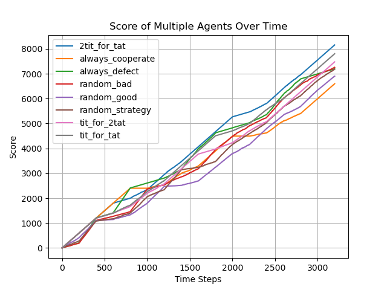

# Axelrod-Tournament


This project recreates the famous Axelrod tournament, allowing easy addition of new strategies by simply adding a Python file to the `agents` folder. Each agent is a Python script that defines a `play` function, which determines the agent's move based on the history of both players.

## Features

- Easily extendable: Add new strategies by creating a new Python file in the `agents` folder.
- Automated tournament execution.
- Graphical visualization of scores.

## Installation

Ensure you have Python installed, then clone the repository and install dependencies:

```sh
git clone https://github.com/lido22/Axelrod-Tournament.git
cd Axelrod-Tournament
pip install -r requirements.txt
```

## How to Add a New Strategy

1. Create a new Python file in the `agents` folder (e.g., `my_strategy.py`).
2. Define a `play` function with the following signature:

```python
def play(opponent_past_moves: list[Outcome], my_past_moves: list[Outcome]) -> Outcome:
    """
    Determines the next move.
    
    Parameters:
        opponent_past_moves (list): List of enum Outcome that represents opponent's past moves
        either cooperate or defect.
        my_past_moves (list): List of the player's own past moves.
    
    Returns:
        str: 'C' for Cooperate or 'D' for Defect.
    """
    #tit-for-tat exampe
    return opponent_past_moves[-1] if len(opponent_past_moves) > 0 else Outcome.cooperate

```

3. Run the tournament to see how your strategy performs!

## Running the Tournament

To execute the tournament, run:

```sh
python simulator.py
```

This script will:

- Import all strategies from the `agents` folder.
- Run a round-robin tournament where each strategy competes against every other strategy.
- Display a plot showing the final scores of all strategies.

## Visualizing Results

After running the tournament, a plot will appear displaying the scores of all participating strategies.



## Example Strategies

The `agents` folder includes some example strategies:

- `always_cooperate.py`: Always cooperates.
- `always_defect.py`: Always defects.
- `tit_for_tat.py`: Cooperates initially, then mimics the opponent's last move.

## Contributing

Feel free to submit pull requests with new strategies or improvements to the tournament logic!

## License

This project is licensed under the MIT License.


